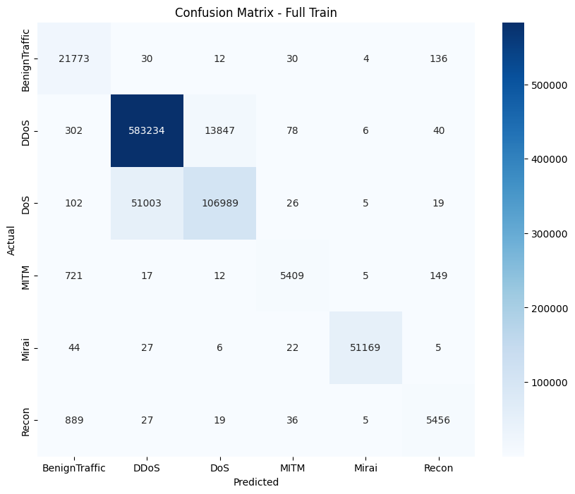
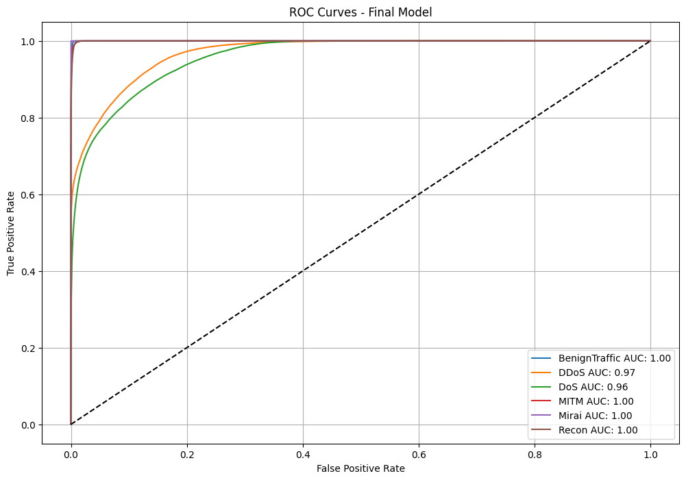
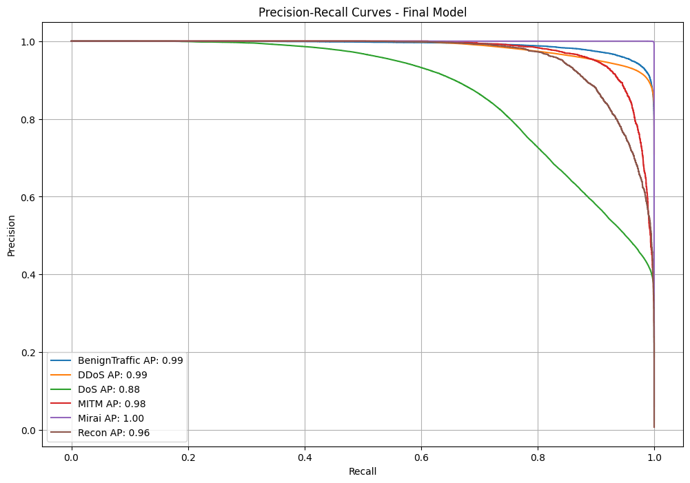

# 🚀 Network Traffic Classification for Cybersecurity (ML Project - Phase 2)
Download full notebook: [Click here](https://colab.research.google.com/drive/1H6D1eGZDDv-Lfj5Jt1-Fq_O0c4K3XO0G?usp=sharing)

## 📌 Overview

In today’s digital landscape, cyber attacks are increasing in complexity and frequency. Traditional security systems often fail to detect evolving attack patterns in time.

This project focuses on building a **Machine Learning model** capable of classifying network traffic into multiple attack categories to enable **early detection and mitigation of cyber threats**.

---

## 🎯 Objective

Develop a multi-class classification model that identifies **6 types of network traffic**:

- 🟢 BenignTraffic (Normal)
- 🔴 DDoS (Distributed Denial of Service)
- 🟠 DoS (Denial of Service)
- 🤖 Mirai (Botnet Attacks)
- 🔍 Recon (Reconnaissance)
- 🕵️ MITM (Man-in-the-Middle)

---

## ⚠️ Challenges

- Highly **imbalanced dataset**
- Complex and subtle attack patterns
- Large-scale data (800K+ samples)

---

## 📊 Dataset Summary

- **Total Samples:** 841,654

| Class         | Count   |
|--------------|--------|
| DDoS         | 597,507 |
| DoS          | 158,144 |
| Mirai        | 51,273  |
| BenignTraffic| 21,985  |
| Recon        | 6,432   |
| MITM         | 6,313   |

---

## 🛠️ Data Preprocessing

- ✅ Removed duplicates  
- ✅ No missing values  
- ✅ Label encoding applied  
- ✅ Feature scaling (Log + RobustScaler for non-tree models)  
- ✅ Feature selection using `SelectKBest`  
- ❌ Removed redundant features (`src_rate`, `dst_rate`)

---

## 🧠 Feature Engineering

A large set of engineered features significantly improved model performance.

### Key Feature Categories:

- 📌 Ratio Features (e.g., header/time, rate/header)
- 🚩 TCP Flag Interactions
- 🌐 Protocol-based Features
- 🔗 Feature Interactions
- 📉 Log & Sqrt Transformations
- 📦 Binned Indicators
- ⚔️ Attack Pattern Features (Phase 2)

👉 Total engineered features: **35+**

---

## 🤖 Models Evaluated

| Model            | Result |
|------------------|--------|
| KNN              | ❌ Too slow |
| Decision Tree    | ❌ Overfitting |
| Random Forest    | ✅ Good baseline |
| SVM (RBF)        | ❌ Not scalable |
| Neural Network   | ⚠️ Struggled with minority classes |
| XGBoost          | ⭐ Best Model |
| Stacking         | ⚠️ Lower Kaggle score |

---

## 🏆 Final Model: XGBoost

### 🔧 Hyperparameters

```python
{
    'max_depth': 10,
    'learning_rate': 0.025,
    'subsample': 0.7,
    'colsample_bytree': 0.7,
    'reg_alpha': 2,
    'reg_lambda': 2,
    'objective': 'multi:softprob'
}
````

### 🧪 Training Setup

* Stratified K-Fold (5 splits)
* Early stopping (20 rounds)
* 800 boosting rounds

---

## 📈 Performance

### ✅ Accuracy

* **Cross-validation:** 0.9098
* **Train Accuracy:** 0.9155
* **Kaggle Score:** 0.9155

### 📊 Classification Metrics

| Class         | Precision | Recall | F1   |
| ------------- | --------- | ------ | ---- |
| BenignTraffic | 0.91      | 0.99   | 0.95 |
| DDoS          | 0.92      | 0.98   | 0.95 |
| DoS           | 0.89      | 0.68   | 0.77 |
| MITM          | 0.97      | 0.86   | 0.91 |
| Mirai         | 1.00      | 1.00   | 1.00 |
| Recon         | 0.94      | 0.85   | 0.89 |

---

## 📊 Visuals

### Confusion Matrix & Model Performance







---

## 🧩 Ensembling (Stacking)

* Models:
  * Neural Network
  * XGBoost
  * LightGBM
* Meta-model: Logistic Regression

📉 Kaggle Score: **0.8507** (lower than XGBoost)

---

## 🔍 Key Insights

* ⭐ **Feature Engineering > Hyperparameter Tuning**
* TCP flag features significantly improved detection
* Log/Sqrt transforms reduced overfitting
* Boosting models handled imbalance better

---

## 🌍 Real-World Impact

* Early detection of cyber attacks
* Supports real-time network monitoring systems
* Helps prevent large-scale breaches

---

## ⚠️ Limitations

* Minority classes still challenging
* Heavy reliance on engineered features
* Dataset imbalance affects recall

---

## ⚖️ Ethical Considerations

* Ensure user privacy is maintained
* Avoid false positives affecting normal users
* Use responsibly in cybersecurity systems

---

## 📌 Conclusion

XGBoost combined with strong feature engineering achieved the best performance, making it a reliable solution for **multi-class network intrusion detection**.

---

```

---

If you want, I can also:
- Add **badges (accuracy, Python version, etc.)**
- Generate a **requirements.txt**
- Or convert this into a **GitHub-ready portfolio project (with demo + API)**
```
